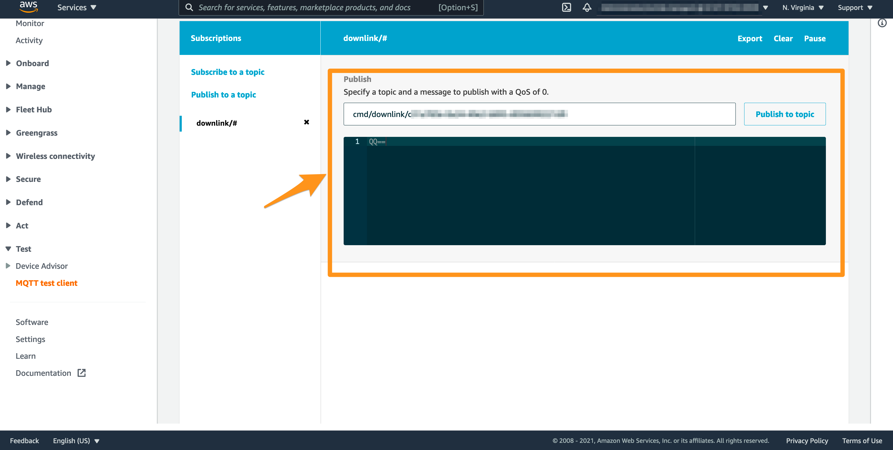
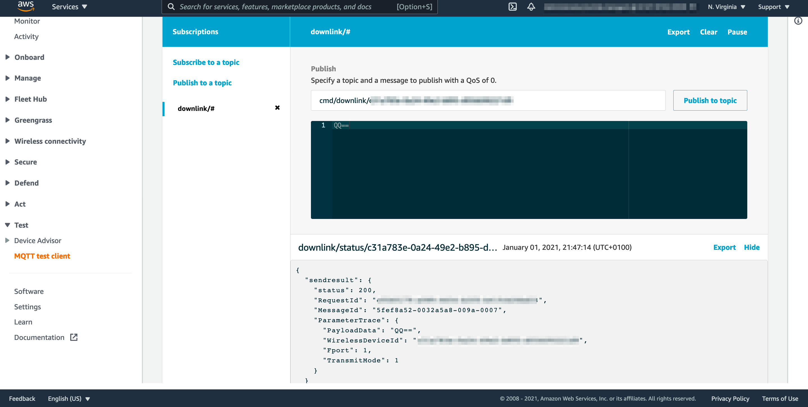

# AWS IoT Core for LoRaWAN - send a downlink payload to a LoRaWAN device by publishing an MQTT message to AWS IoT Core

As LoRaWAN protocol supports a bidirectional communication, you can send messages to your LoRaWAN devices. For that purpose AWS IoT Core for LoRaWAN provides an API [SendDataToWirelessDevice](https://docs.aws.amazon.com/iot-wireless/2020-11-22/apireference/API_SendDataToWirelessDevice.html) as well as related SDK functions (e.g. [AWS SDK for Python](https://boto3.amazonaws.com/v1/documentation/api/latest/reference/services/iotwireless.html#IoTWireless.Client.send_data_to_wireless_device), [AWS SDK for Java](https://sdk.amazonaws.com/java/api/latest/software/amazon/awssdk/services/iotwireless/IotWirelessClient.html#sendDataToWirelessDevice-software.amazon.awssdk.services.iotwireless.model.SendDataToWirelessDeviceRequest-), [AWS SDK for Javascript](https://docs.aws.amazon.com/AWSJavaScriptSDK/latest/AWS/IoTWireless.html#sendDataToWirelessDevice-property)).

This sample can be interesting for you if you look for an example on how to send data to a LoRaWAN device with AWS SDK (see [this example](src/app.py)) and AWS CLI (see [this example](#additional-note)).

It can be also interesting for you if you consider to use AWS IoT Core message broker to send a downlink message to a LoRaWAN device. For example, if your application uses MQTT for sending messages to other non-LoRaWAN based IoT devices and you want to minimize necessary modifications in the applications to integrate LoRaWAN devices, you may want to send data to both you non-LoRAWAN and LoRaWAN devices by publishing to the AWS IoT Core message broker to reduce complexity.  However, please consider that the usage of an MQTT message broker for sending downstream messages to LoRaWAN devices has several downsides, like increased complexity in error handling as well as additional [costs for AWS IoT Core](https://aws.amazon.com/iot-core/pricing/) and [costs for AWS Lambda](https://aws.amazon.com/lambda/pricing/). We encourage you to cautiously evaluate both options for your use case. 

A recommended approach for sending data to a LoRaWAN device is a usage of SDK functions as listed in the "See also" seciton of  [SendDataToWirelessDevice](https://docs.aws.amazon.com/iot-wireless/2020-11-22/apireference/API_SendDataToWirelessDevice.html) documentation.

This sample provides an example of sending a downlink message to a LoRaWAN device by publishing an MQTT message to AWS IoT Core message broker topic `cmd/downlink/<AWS IoT Core for LoRaWAN WirelessDeviceId>`. 


## What you are going to build

A picture bellow illustrates an overall approach:


By launching the AWS CloudFormation stack in your AWS account you will create the following resources:

- **AWS IoT rule "\<stackname>-SendDataToWirelessDeviceRule"  with necessary permissions (i.e. IAM Roles).**
    The IoT Rules subscribes to the MQTT topic `cmd/downlink/#`. Each time the rule receives an MQTT message, it will extract the WirelessDeviceId from the topic name and binary payload from the message payload. Then it will invoke the AWS Lambda Function **\<stackname>_-SendDataToWirelessDeviceFunction** to send the payload to a LoRaWAN device with a specified WirelessDeviceId. Finally will republish the response of the AWS Lambda function to the topic 'downlink/status/\<WirelessDeviceId>'. You can find the details of the rule in file [template.yaml](template.yaml)

- **AWS Lambda function \<stackname>_-SendDataToWirelessDeviceFunction with necessary permissions (i.e. IAM Roles).**
  
    The Lambda function will receive the payload and WirelessDeviceId as an input and invoke the [SendDataToWirelessDevice API with AWS SDK for Python](https://boto3.amazonaws.com/v1/documentation/api/latest/reference/services/iotwireless.html#IoTWireless.Client.send_data_to_wireless_device). As an output, it will return the result of API invocation (i.e. MessageId and RequestId). You will find the source code for this Lambda function [here](src/app.py).
  

# Quick setup

## Step 1: Launch stack in your AWS account

Please perform following steps to deploy the stack with AWS SAM:

1. Check out this repository on your computer

    ```shell
    git clone https://github.com/aws-samples/aws-iot-core-lorawan 
    cd aws-iot-core-lorawan/send_downlink_payload
    ```

2. This sample uses AWS SAM to build and deploy all necessary resources (e.g. AWS Lambda function, AWS IoT Rule, AWS IAM Roles) to your AWS account. Please perform the following commands to build the SAM artifacts:

   ```shell
   sam build
   ```

3. Deploy the SAM template to your AWS account.

   ```shell
   sam deploy --guided --stack-name senddownlinkpayload
   ```

    Please note that `sam deploy --guided --stack-name senddownlinkpayload` should be only executed for a first deployment. To redeploy after that please run `sam deploy`.

    After starting `sam deploy --guided --stack-name senddownlinkpayload` please select arguments for the stack deployment. You can also leave the default arguments.

4. After the deployment is completed, you should receive output parameters of the stack and a confirmation message, e.g.

    ```shell
    Successfully created/updated stack - senddownlinkpayload in us-east-1
    ```


## Step 2: Select a WirelessDeviceId for a target LoRaWAN device 
You can use AWS CLI to list all LoRaWAN devices registred with AWS IoT Core for LoRaWAN:

```shell
aws iotwireless list-wireless-devices  
```

You will receive output similar to that one:

```json
{
    "WirelessDeviceList": [
       {
            "Arn": "arn:aws:iotwireless:us-east-1:614797420359:WirelessDevice/4d9f57d2-52e9-4d20-b920-239c65eb9b53",
            "Id": "31a783e-0a24-49e2-b895-d056690221d9",
            "Type": "LoRaWAN",
            "Name": "My LoRaWAN Device",
            "DestinationName": "MyDestination",
            "LoRaWAN": {
                "DevEui": "a1111111111111"
            }
        }
    ]
}
```

The WirelessDeviceId here is `31a783e-0a24-49e2-b895-d056690221d9`

## Step 3: Send a Base64 payload to a pre-defined topic

Please publish a message to a topic `cmd/downlink/<WirelessDeviceId>` (e.g. `cmd/downlink/c31a783e-0a24-49e2-b895-d056690221d9`). The message payload should be Base64-encoded (i.e. if you want to publish 1 byte with value 65 you should put 'QQ==' into payload). You can use a following command on a Linux operating system to encode hexadecimal payload into base64:

```shell 
$ echo "41" | xxd -r -p | base64
QQ==
```

To publish a test message, please use [AWS Iot MQTT client](https://docs.aws.amazon.com/iot/latest/developerguide/view-mqtt-messages.html) to publish payload (e.g. `QQ==`) to the topic `cmd/downlink/<WirelessDeviceId>`:


You can also perform a following AWS CLI call (note that you will need to perform Base64 encoding twice in this case, as àws iot-data publish` also expects Base64 encoded payloads):

```shell
aws iot-data publish --topic cmd/downlink/c31a783e-0a24-49e2-b895-d056690221d9 --payload UVE9PQ== --region us-east-1
```

You can configure additional parameters for sending messages to your device in a CloudFormation template:

- **LoRaWANAFPort**: the value of [port field](https://lora-developers.semtech.com/library/tech-papers-and-guides/the-book/the-port-field/)
- **TransmitMode**: 0 for UM (unacknowledged mode), 1 for AM (acknowledge mode)

### Additional note
For the sake of explanation, below you will find an example for direct invocation of [SendDataToWirelessDevice](https://docs.aws.amazon.com/iot-wireless/2020-11-22/apireference/API_SendDataToWirelessDevice.html) that will have the same effect as the above mentioned examples. Please note, that by direct usage of API you avoid additional costs for IoT Core Message Broker and AWS Lambda.

```shell
aws iotwireless send-data-to-wireless-device --cli-input-json file://payload.json
```

Sample content of `payload.json`:

```json
{
    "Id": "c31a783e-0a24-49e2-b895-d056690221d9",
    "TransmitMode": 1,
    "PayloadData": "QQ==",
    "WirelessMetadata": {
        "LoRaWAN": {
            "FPort": 1
        }
    }
}
```

## Step 4: Optional: monitor responses from a AWS IoT Core for LoRaWAN 

You can subscribe to topics `downlink/status/#` and `downlink/error/#` to see a response from the AWS IoT Core for LoRaWAN API.

The following screenshot provides an example of how your console may look like after publishing:



