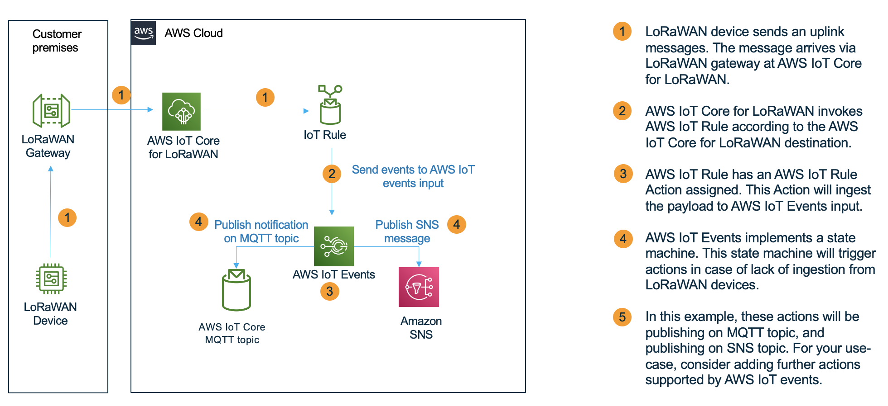
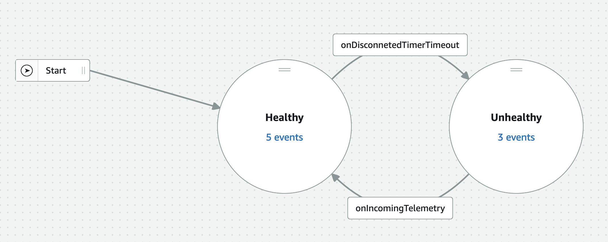
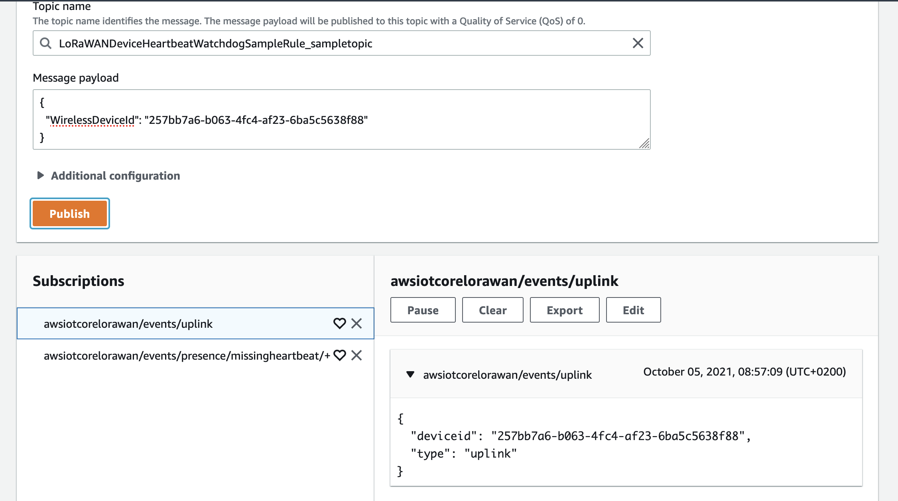
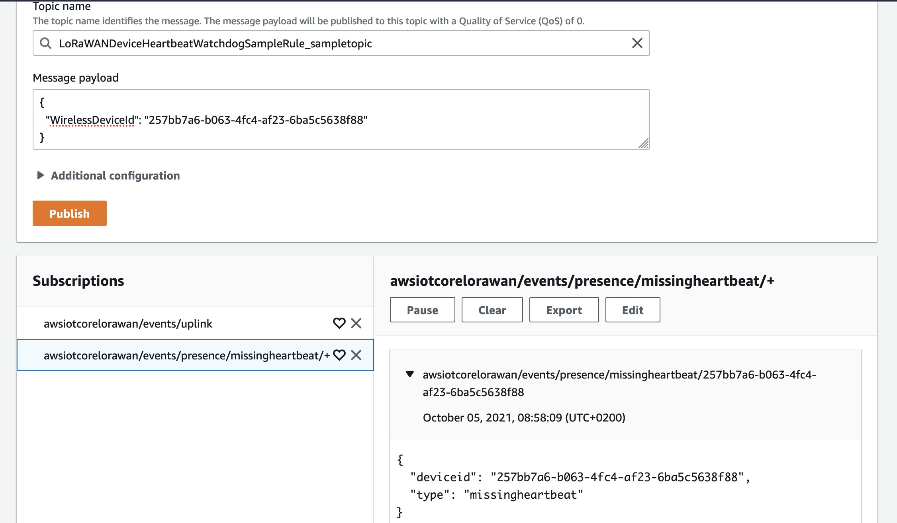

# Monitoring and notifications for LoRaWAN device connection status

This sample contains an example solution for monitoring connectivity status of LoRaWAN devices. For example, imagine you have a temperature sensor which typically sends telemetry once an hour.  You want to be notified if no telemetry from the sensor arrived after 60 minutrs, e.g, due to connectivity issues or sensor malfunction. 

After deploying and configuring this solution in your AWS account, you will receive an e-mail message each time one of configured LoRaWAN devices is not sending uplink for longer then specified period of time. Additionaly, a message will be published to AWS IoT Core message broker MQTT topic (`awsiotcorelorawan/events/presence/missingheartbeat/+`).


## Solution Architecture

Below you see a diagram with the solution architecture:


For AWS IoT Events, the following detector model (i.e., the state machine) will be deployed:  


## Quick deployment

Please run the following commands in your local shell or in AWS CloudShell.

### **1. Deploy the CDK stack**

``` shell
# Clone the repository 
git clone https://github.com/aws-samples/aws-iot-core-lorawan
cd aws-iot-core-lorawan/device_watchdog
# Set up and activate virtual environment
python3 -m venv .env
source .env/bin/activate 
# Install AWS CDK and neccessary CDK libraries
npm install -g aws-cdk
pip3 install -r requirements.txt   
# If first time running CDK deployment in this account / region, run CDK bootstap
# This is a one-time activity per account/region, e.g. 
# cdk bootstrap aws://123456789/us-east-1
cdk bootstrap aws://<Account Id>/<Region name>
# Deploy the stack. Ensure to replace <E-Mail> with the E-Mail adresss to send notifications to.
cdk deploy --parameters emailforalarms=<E-Mail> --parameters notifyifinactivseconds=60
```

Please note, that for simplicity of testing the threshold for notification of missing uplink is set to 60 seconds. 

### **2. Confirm the SNS e-mail subscription**  

Please check your mailbox for an e-mail message with subject "AWS Notification - Subscription Confirmation" and confirm the subscription.


### **3. Review sample AWS IoT Rule**
In the AWS IoT management console, please select Act, Rules and click on the rule ["LoRaWANDeviceHeartbeatWatchdogSampleRule"](https://console.aws.amazon.com/iot/home?#/rule/LoRaWANDeviceHeartbeatWatchdogSampleRule).


To implement monitoring and notifications for your LoRaWAN devices, you will need to add an "Send a message to an IoT Events Input" action targeting input `LoRaWANDeviceWatchdogInput` to the respective AWS IoT Rules.

### **4. Perform a test**

**Start MQTT Test client**  
Please open the [MQTT Test client](https://console.aws.amazon.com/iot/home?region=#/test) and subscribe to the topics `awsiotcorelorawan/events/uplink` and `awsiotcorelorawan/events/presence/missingheartbeat/+`.

**Publish test payload**  
Please publish the following payload on the MQTT topic `LoRaWANDeviceHeartbeatWatchdogSampleRule_sampletopic`:

```json
{
  "WirelessDeviceId": "257bb7a6-b063-4fc4-af23-6ba5c5638f88"
}
```


As an alternative to using AWS IoT MQTT Test client, you can also  invoke the following command using AWS CLI:
```shell
aws iot-data publish --topic LoRaWANDeviceHeartbeatWatchdogSampleRule_sampletopic --payload eyJXaXJlbGVzc0RldmljZUlkIjoiMjU3YmI3YTYtYjA2My00ZmM0LWFmMjMtNmJhNWM1NjM4Zjg4In0K
```

**View notifications**  

Immediately after an invocation of `aws iot-data publish`,  you should see an MQTT message published on `awsiotcorelorawan/events/uplink`:



After duration configured during the stack deployment, you should see an MQTT message published on `awsiotcorelorawan/events/presence/missingheartbeat/+`:




### **5.Remove the stack**

``` 
cd aws-iot-core-lorawan/device_watchdog
cdk destroy
```


## Troubleshooting

### View AWS IoT Events logs

1. Open AWS IoT Events settings [here](https://console.aws.amazon.com/iotevents/home?region=#/settings/logging)
2. Configure Logging on "DEBUG" level with a debug target as detector model `LoRaWANGatewayConnectivityModel`
3. View the CloudWatch logs for potentially helpful error messages from AWS IoT Events

